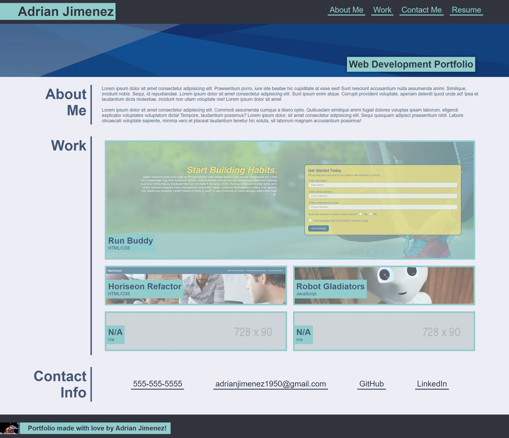

# Portfolio Challenge

## Contents
This is Adrian Jimenez's portfolio challenge submission. 

To complete this project I initially wireframed the site as I thought it would be structured based on the mockup. Then I began making a rough outline of all the main elements, using elements with little to no style to design a rough layout of how the page should look. Afterwards, I spent alot of time working to optimize both the CSS and HTML code, minimizing on repititions, and properly positioning elements as I saw fit. After much tweaking, I then added media queries to the stylesheet to allow the webpage to become fully responsive. After some finishing touches I was finally complete with the site, which I can later restructure and edit when I learn more.

Once I completed this task I deployed the project onto GitHub Pages.

## Built With
* HTML
* CSS

## Preview

## Website

## Credits
Made by Adrian Jimenez

## License

MIT License

Copyright ©️ 2022 Adrian Jimenez

Permission is hereby granted, free of charge, to any person obtaining a copy
of this software and associated documentation files (the "Software"), to deal
in the Software without restriction, including without limitation the rights
to use, copy, modify, merge, publish, distribute, sublicense, and/or sell
copies of the Software, and to permit persons to whom the Software is
furnished to do so, subject to the following conditions:

The above copyright notice and this permission notice shall be included in all
copies or substantial portions of the Software.

THE SOFTWARE IS PROVIDED "AS IS", WITHOUT WARRANTY OF ANY KIND, EXPRESS OR
IMPLIED, INCLUDING BUT NOT LIMITED TO THE WARRANTIES OF MERCHANTABILITY,
FITNESS FOR A PARTICULAR PURPOSE AND NONINFRINGEMENT. IN NO EVENT SHALL THE
AUTHORS OR COPYRIGHT HOLDERS BE LIABLE FOR ANY CLAIM, DAMAGES OR OTHER
LIABILITY, WHETHER IN AN ACTION OF CONTRACT, TORT OR OTHERWISE, ARISING FROM,
OUT OF OR IN CONNECTION WITH THE SOFTWARE OR THE USE OR OTHER DEALINGS IN THE
SOFTWARE.
